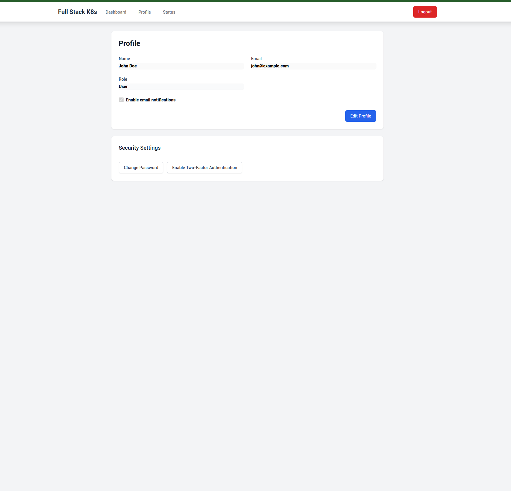

# React Python CI/CD Deployment

A modern full-stack application demonstrating CI/CD practices with React frontend and Python backend, deployed on Kubernetes. This project showcases a production-ready setup with automated deployment pipelines, containerization, and cloud infrastructure.


#### ADMIN ACCESS
user: admin@example.com
password: admin123

# Start the development environment
docker-compose up

# Access the applications
Frontend: http://localhost:3000
Backend: http://localhost:8000
```

## 📁 Project Structure

```
.
├── frontend/                 # React frontend application
│   ├── src/                 # Source code
│   ├── public/             # Static files
│   └── Dockerfile          # Frontend container configuration
├── backend/                 # Python backend application
│   ├── app/                # Application code
│   ├── tests/              # Test files
│   └── Dockerfile          # Backend container configuration
├── k8s/                    # Kubernetes configurations
│   ├── frontend-deployment.yaml
│   ├── backend-deployment.yaml
│   └── ingress.yaml
├── scripts/                # Deployment and utility scripts
├── docs/                   # Documentation and images
└── docker-compose.yml      # Local development setup
```

## 🚀 Features

### Frontend
- Modern React 18+ application with TypeScript support
- React Router v6 for navigation
- Redux Toolkit for state management
- Tailwind CSS for modern, responsive UI
- Secure JWT-based authentication system
- Interactive dashboard with data visualization using Recharts
- Responsive design with mobile-first approach
- Environment-based configuration (.env files)
- Form validation and error handling
- Protected routes and role-based access control

### Backend
- FastAPI-based REST API with async support
- PostgreSQL database with SQLAlchemy ORM
- JWT authentication with refresh tokens
- Async request processing
- Health check endpoints
- Prometheus metrics integration
- Database migrations with Alembic
- Environment-based configuration
- Input validation with Pydantic
- CORS middleware for security
- Rate limiting and request throttling

### Infrastructure
- Docker containerization with multi-stage builds
- Kubernetes deployment with Helm charts
- GitHub Actions CI/CD pipeline
- Automated testing (Jest, Pytest)
- Container registry integration (GitHub Container Registry)
- Infrastructure as Code (IaC)
- Nginx Ingress Controller
- Persistent storage with PVCs
- Horizontal Pod Autoscaling
- Network policies for security

## 🛠️ Tech Stack

### Frontend
- React 18+
- Redux Toolkit
- React Router v6
- Tailwind CSS
- Axios
- Recharts
- Jest & React Testing Library

### Backend
- Python 3.9+
- FastAPI
- SQLAlchemy
- PostgreSQL
- Pydantic
- Alembic
- Pytest

### Infrastructure
- Docker & Docker Compose
- Kubernetes
- GitHub Actions
- Nginx
- Prometheus & Grafana
- GitHub Container Registry

## 📋 Prerequisites

### Required Software
- Docker and Docker Compose
- Kubernetes cluster (minikube, kind, or cloud provider)
- Node.js 18+
- Python 3.9+
- kubectl
- Git

### Required Accounts
- GitHub account (for CI/CD)
- Container registry access
- Cloud provider account (if using cloud Kubernetes)

## 🚀 Getting Started

### Local Development

1. Clone the repository:
   ```bash
   git clone https://github.com/murilolivorato/k8s-react-python-ci-cd-deploy
.git
   cd k8s-react-python-ci-cd-deploy

   ```

2. Environment Setup:
   ```bash
   # Frontend environment
   cp frontend/.env.example frontend/.env.development
   
   # Backend environment
   cp backend/.env.example backend/.env
   ```

3. Start the development environment:
   ```bash
   docker-compose up
   ```

4. Access the applications:
   - Frontend: http://localhost:3000
   - Backend: http://localhost:8000
   - API Documentation: http://localhost:8000/docs

### Development Setup

#### Frontend Development
```bash
cd frontend
npm install
npm start
```

#### Backend Development
```bash
cd backend
python -m venv venv
source venv/bin/activate  # or `venv\Scripts\activate` on Windows
pip install -r requirements.txt
uvicorn main:app --reload
```

## 🚢 Deployment

### Kubernetes Deployment

1. Configure Kubernetes cluster:
   ```bash
   # Set up kubectl context
   kubectl config use-context your-cluster-context
   
   # Create namespace
   kubectl create namespace app
   ```

2. Build and push Docker images:
   ```bash
   ./scripts/build-images.sh
   ```

3. Deploy to Kubernetes:
   ```bash
   kubectl apply -f k8s/
   ```

4. Verify deployment:
   ```bash
   kubectl get all -n app
   ```

### CI/CD Pipeline

The project includes a GitHub Actions workflow that:
- Runs automated tests
- Builds Docker images
- Pushes to container registry
- Deploys to Kubernetes cluster
- Performs health checks
- Updates deployment status

## 📊 Monitoring and Observability

- Prometheus metrics endpoints (/metrics)
- Grafana dashboards for visualization
- Distributed tracing with OpenTelemetry
- Centralized logging with ELK stack
- Health check endpoints (/health)
- Performance monitoring
- Resource usage metrics
- Error tracking and alerting

## 🔒 Security

- JWT-based authentication with refresh tokens
- Environment variable management
- Kubernetes secrets for sensitive data
- Secure container registry access
- HTTPS/TLS encryption
- Regular security updates
- Network policies
- RBAC (Role-Based Access Control)
- Input validation and sanitization
- CORS configuration
- Rate limiting

## 🐛 Troubleshooting

### Common Issues

1. **Frontend not connecting to backend**
   - Check environment variables
   - Verify CORS settings
   - Ensure backend is running

2. **Database connection issues**k8s-laravel-quasar-deploy
k8s-laravel-quasar-deploy
k8s-laravel-quasar-deploy
   - Check pod status: `kubectl get pods -n app`
   - View pod logs: `kubectl logs <pod-name> -n app`
   - Check ingress: `kubectl get ingress -n app`

### Debug Commands

```bash
# Check container logs
docker-compose logs -f

# Check Kubernetes resources
kubectl get all -n app

# Check pod logs
kubectl logs -f <pod-name> -n app

# Check ingress
kubectl describe ingress -n app
```

## 🤝 Contributing

1. Fork the repository
2. Create your feature branch (`git checkout -b feature/AmazingFeature`)
3. Commit your changes (`git commit -m 'Add some AmazingFeature'`)
4. Push to the branch (`git push origin feature/AmazingFeature`)
5. Open a Pull Request

### Development Guidelines
- Follow the existing code style
- Write tests for new features
- Update documentation
- Ensure all tests pass
- Update environment variables if needed

## 📝 License

This project is licensed under the MIT License - see the [LICENSE](LICENSE) file for details.

## 👥 Author

For questions, suggestions, or collaboration:
- **Author**: Murilo Livorato
- **GitHub**: [murilolivorato](https://github.com/murilolivorato)
- **linkedIn**: https://www.linkedin.com/in/murilo-livorato-80985a4a/

## 🙏 Acknowledgments

- FastAPI documentation
- React documentation
- Kubernetes documentation
- Docker documentation
- Open source community

## 📸 Screenshots

### Login Page


### Dashboard


### Edit Profile


<div align="center">
  <h3>⭐ Star This Repository ⭐</h3>
  <p>Your support helps us improve and maintain this project!</p>
  <a href="https://github.com/murilolivorato/k8s-react-python-ci-cd-deploy
/stargazers">
    
  </a>
</div>